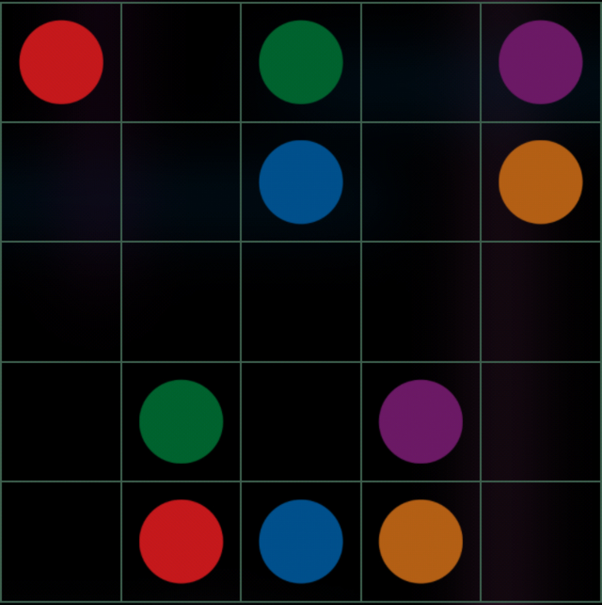

<h1>FlowFreeSolver</h1>
<h3>This is a script to solve puzsles in the game flow free.</h3>

 <h2>board.txt</h2>
 board.txt is a text file to show the stating state of the board.
 0: Empty circle 
 1: Red
 2: Dark Red
 3: Blue
 4: Teal
 5: Dark purple
 6: Light Purple
 7: Green
 8: Yellow
 9: Orange

<h3>Example:</h3>

Would be:

1 0 7 0 5
 0 0 3 0 9
 0 0 0 0 0
 0 7 0 5 0
 0 1 3 9 0

